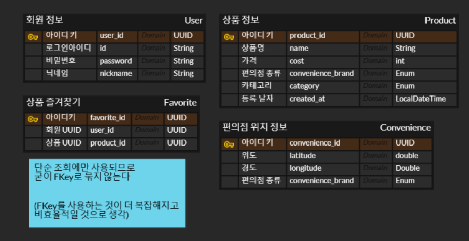

# 편의점 행사 상품 정보 제공 서버
편의점의 행사 정보를 제공해주는 앱의 서버를 제작하고자 합니다
## 기능
### 편의점 위치 크롤링
전국의 편의점 위치를 저장. cron을 사용해서 한 달에 한번 크롤링 진행
### 편의점 상품 정보 크롤링
편의점들의 행사 상품 정보를 저장(상품명, 행사 종류(1+1,2+1)). cron을 사용해서 한달에 한번 진행.

모든 편의점들의 상품 카테고리가 동일하지 않기 때문에, HuggingFace에서 이미 개발되어 있는 AI 모델을 기반으로 편의점 상품의 카테고리 분류를 시도
### 상품 조회
상품의 정보들을 조회. 편의점별, 카테고리별, 행사 종류별 분류
### 즐겨찾기
기본적인 회원가입을 개발하고, 많이 찾는 상품에 즐겨찾기 가능하도록 진행

## 상세 개발 API
[API 명세서](https://documenter.getpostman.com/view/40737812/2sB2ixitFi)
- (스케줄링으로 달에 한번) 편의점 상품 크롤링
- 상품 조회(가격순 정렬)
- 편의점 별 상품 조회
- 카테고리 별 상품 조회
- 회원 가입
- 로그인
- 상품 즐겨찾기 등록
- 상품 즐겨찾기 취소
- 상품 즐겨찾기 리스트 조회
- 상품 검색

## [ERD](https://www.erdcloud.com/d/QnaJSNkLZEWPn6fW3)

## 사용 스택
### [백엔드]
- Spring
### [DB]
- MySQL 8.0 `Left Join 등 여러 복잡한 쿼리를 사용하기 위해`
### [인프라]
- [HuggingFace](https://huggingface.co/ChyoPyoRo/convenience-product-classifier)
- Aws

## 예상되는 어려운 점
~~개발 완료시 개발하면서 어려웠던 점으로 수정~~
1. 편의점 별로 사이트 구조가 달라서 크롤링에 어려움이 있을 것 같습니다. 그래서 일단 gs25를 먼저 크롤링 해보고, 모든 기능을 완성한 뒤에, 다른 편의점을 추가해보고 싶습니다.
2. HuggingFace를 이용해보는 것이 처음이라 난관에 부딫힐 수도 있을 것 같습니다.

#### [편의점 위치 정보 출처 ](https://safemap.go.kr/opna/data/dataView.do?objtId=145)
